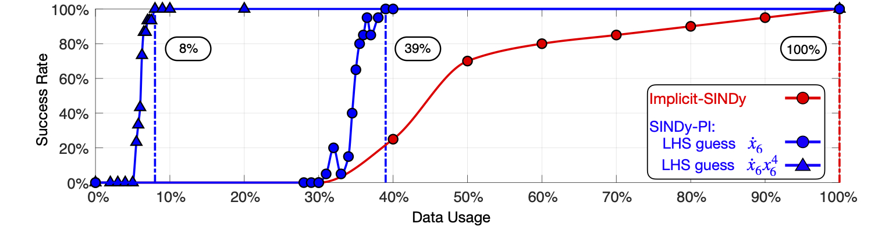

# Instruction

This folder constains the files that compare the data usage of the SINDy-PI and implicit-SINDy. 

# How to run
* First generate the data using "Yeast_glycolysis_Data_Generation_Main.m".
* Please unzip the file in "iSINDy\results" and "SINDy-PI\Results"

For implicit-SINDy
* Please run the "S6_yeast_glycolysis_SwipeLength.m" to see the data usage of the implicit-SINDy.

For SINDy-PI
* Please run the "YeastGlycolysis_DL_Auto_Test_SwipeLength_Main.m" file to generate the result.

Finally please run the "Plot_All_Together.m" to compare the final result.
