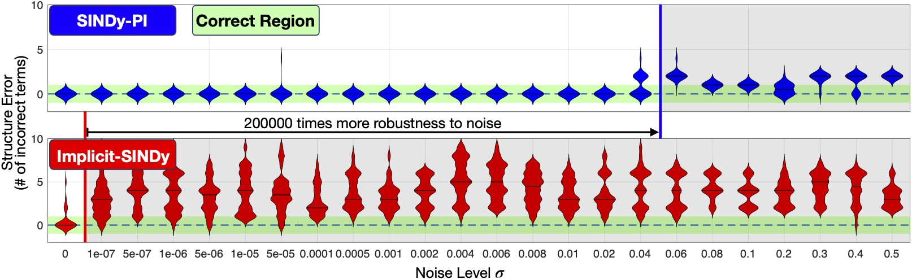

# Instruction

This folder constains the files that compare the noise sensitivity of the SINDy-PI and implicit-SINDy. 

# How to run
* First generate the data using "Generate_Train_Test_Data.m".
* The previous result we got could be obtained by unzip the "Michaelis-Menten kinetics\FinalResult.zip"

For implicit-SINDy
* Please run the "MMK_Noise_implicit_SINDy.m" to see the performance of the implicit SINDy under noise.

For SINDy-PI
* Please run the "MMK_Noise_SINDy_PI.m" file to see the performance of SINDy-PI under noise.

Finally please run the "Plot_All_Result_Main.m" to compare the final result of the implicit-SINDy and SINDy-PI.
