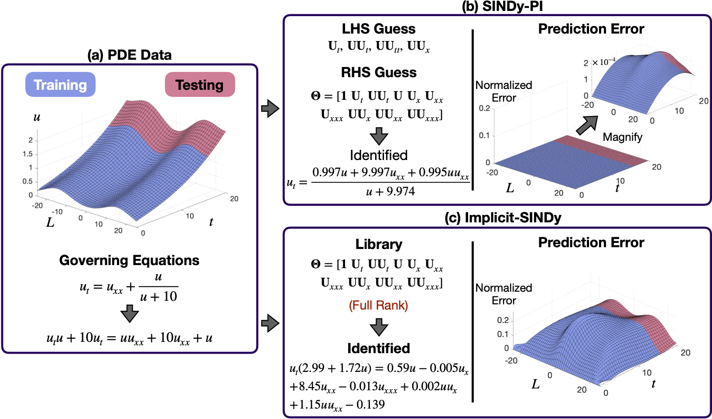

# Instruction

This folder constains the example of comparing the performance of the SINDy-PI and implicit-SINDy on identfying a rational PDE. This folder contains file to run SINDy-PI and implicit-SINDy. We use this example to demenstrate that implciit-SINDy is sensity to the implicit PDE problem and will not yeld correct result on this example. 

# How to run

* Please run the "Implict_PDE_Example_1_DL_Main.m" file to generate the result of using SINDy-PI. Then run the "Implict_PDE_Example_1_Implicit_SINDy_Main.m" to generate the result of using implicit-SINDy to identify the rational PDE.
