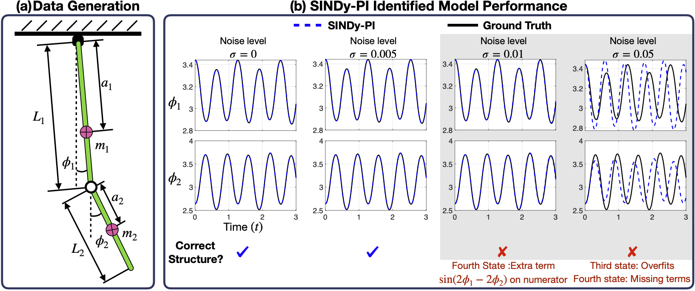

# Instruction

This folder constains the example of using the SINDy-PI to identify equation of motion (EOM) of the mounted double pendulum.

# How to run

* Please run the "DoublePendulum_Main.m" to identify the EOM of the mounted double pendulum.
