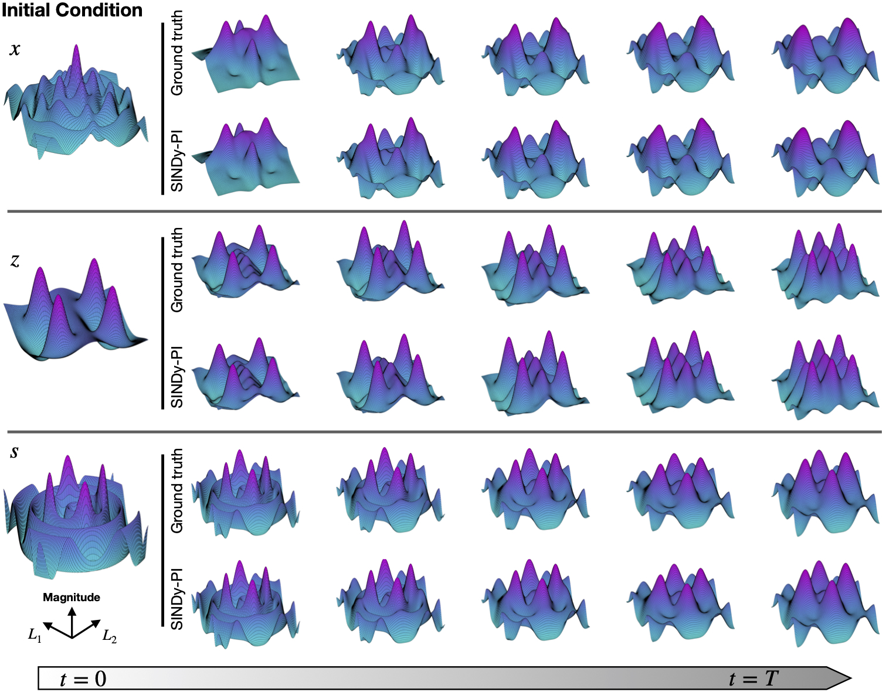

# Instruction

This folder contains the file to simulate and identify the PDE of Belousov–Zhabotinsky(BZ) reaction. 

# How to run
* First run the "Data_Generation_BZ_Main.m" to generate the simulation file.
* Next run the "BZ_Reaction_SINDy_PI_Main.m" file to identify the PDEs of the BZ reaction.
* To check the symbolic equation of the identified PDE equation, please run the "Show_Result.m".
* To compare the performance of the SINDy-PI identified PDE and ground truth, please manually modify the "BZ_Reaction_SINDy_PI_PDE.m" file to write down the PDE discovered by SINDy-PI. Then run the "Compare_the_result.m" file.

