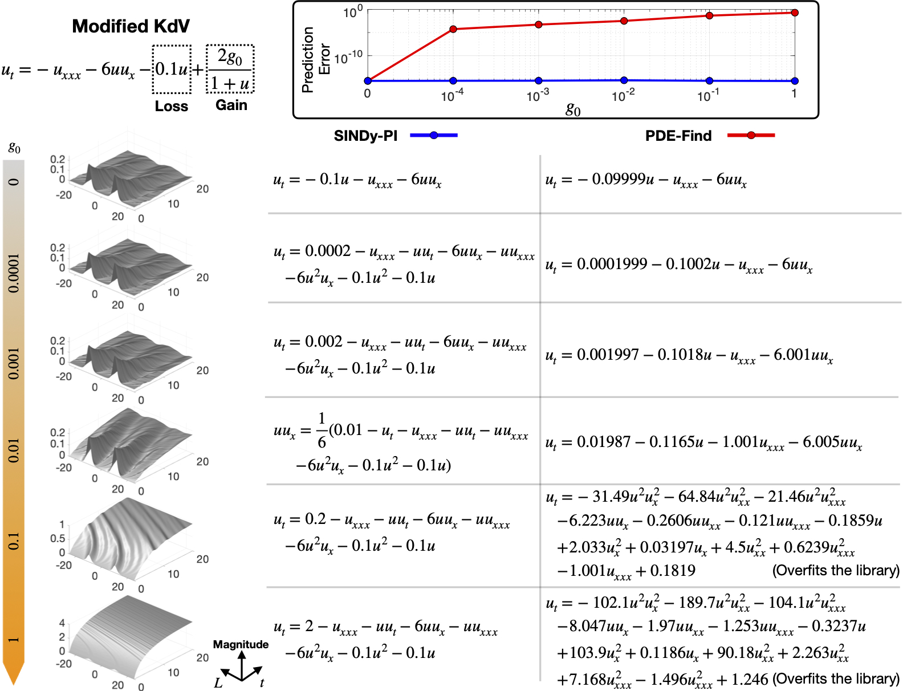

# Instruction

This folder constains the example of using the SINDy-PI to identify the modified Kroteweg-de Vires (KdV) equation. We will compare the performance of the SINDy-PI and PDE-Find.

# How to run

* First, please run the "DataGeneration.m" file to generate the simulation data of modified KdV equation.
* Next, please run the "PDE_Find_Main.m" file to run the PDE-FInd identified equation. You need to run this file multiple times to for different simulation data.
* Next, please run the "SINDy_PI_KdV_Main.m" to use the SINDy-PI to identify the modified KdV equation. You need to run this file multiple times to for different simulation data.
* To compare the prediction performance of the SINDy-PI and PDE-Find identified equation, please run the "Plot_Compare.m".

