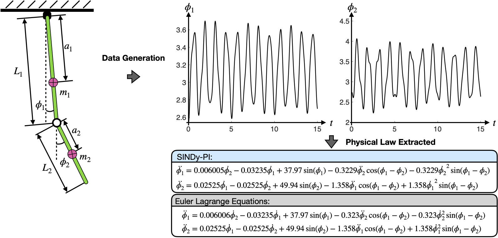

# Instruction

This folder constains the example of using the SINDy-PI to identify Euler-Lagrange's equation of the mounted double pendulum.

# How to run

* To check the symbolic eexpression of the Euler-Lagrange's equation of the double pendulum please run "SymCal_LagHamil.m" file.
* To identify the Euler-Lagrange's equation of double pendulum please run "DoublePendulum_EL_Main.m".
