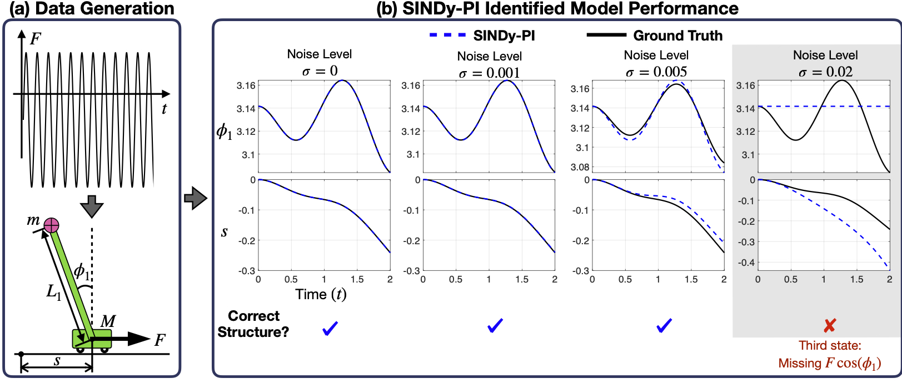

# Instruction

This folder constains the example of using the SINDy-PI to identify equation of motion (EOM) of the single pendulum on a cart system.

# How to run

* Please run the "SinglePendulum_Main.m" file.
